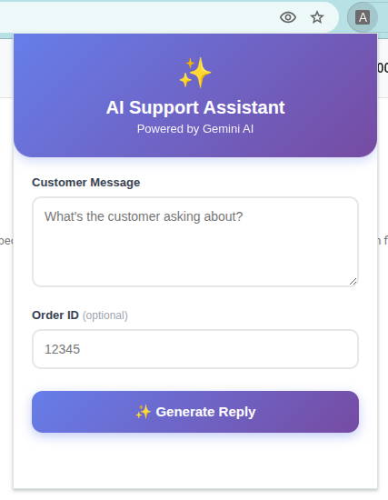
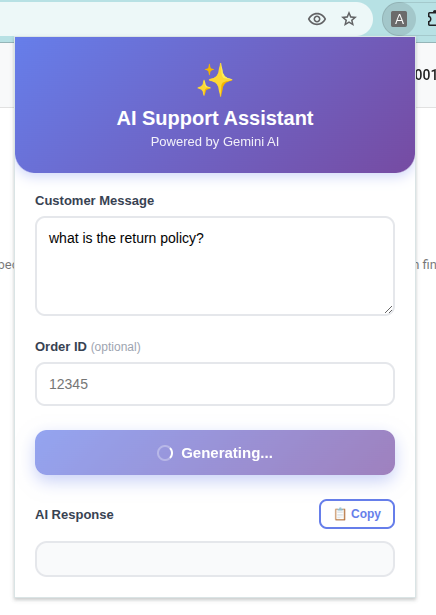
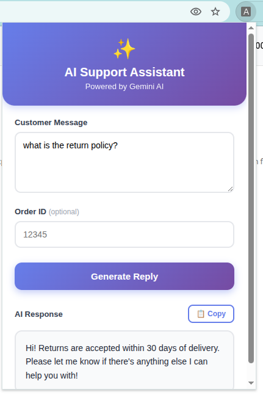

# AI Support Assistant

🚀 **Production-Ready Chrome Extension**

A fully deployed Chrome extension powered by Google Gemini AI that helps customer support agents generate intelligent, context-aware responses using RAG (Retrieval-Augmented Generation) with knowledge base integration and real-time order lookup capabilities.

**Live Backend**: `https://ai-support-extension.vercel.app`

## Screenshots

### Extension Interface


### Generating Response


### AI Response


## Features

- **AI-Powered Responses**: Leverages Google Gemini AI for natural language generation
- **RAG Integration**: Retrieves relevant information from knowledge base using vector embeddings
- **Order Lookup**: Fetches real-time order data from Supabase
- **Chrome Extension**: Easy-to-use popup interface for support agents
- **Production Deployment**: Live on Vercel with serverless architecture
- **Real-time Streaming**: Server-sent events for instant AI responses

## Project Structure

```
ai-support-extension/
├── backend/
│   ├── api/
│   │   └── generateReply.js       # Vercel serverless function
│   ├── src/
│   │   ├── config/                # Configuration files
│   │   ├── services/              # Business logic (genai, rag, orders)
│   │   └── utils/                 # Helper functions
│   ├── data/
│   │   └── kb.json                # Knowledge base content
│   ├── scripts/
│   │   └── embed_kb.js            # One-time embedding script
│   ├── .env                       # Environment variables
│   └── package.json
└── extension/
    ├── manifest.json              # Chrome extension config
    ├── popup.html                 # Extension UI
    ├── popup.js                   # Frontend logic
    └── styles.css                 # Styling
```

## Setup

### Prerequisites

- Node.js (v18+)
- Google Gemini API key ([Get one here](https://ai.google.dev/))
- Supabase account and project ([Sign up](https://supabase.com/))
- Vercel account ([Sign up](https://vercel.com/))

### Backend Setup

1. **Navigate to backend directory**
   ```bash
   cd backend
   ```

2. **Install dependencies**
   ```bash
   npm install
   ```

3. **Configure environment variables**
   
   Create a `.env` file in the `backend/` directory:
   ```env
   PORT=3000
   GEMINI_API_KEY=your_gemini_api_key
   SUPABASE_URL=your_supabase_url
   SUPABASE_SERVICE_ROLE_KEY=your_supabase_key
   ```

4. **Generate knowledge base embeddings** (one-time setup)
   ```bash
   node scripts/embed_kb.js
   ```
   This reads `data/kb.json`, creates vector embeddings, and saves them for RAG retrieval.

5. **Deploy to Vercel**
   ```bash
   vercel
   ```
   Or for local testing:
   ```bash
   npm run dev
   ```

### Extension Setup

1. **Open Chrome and navigate to**
   ```
   chrome://extensions/
   ```

2. **Enable Developer Mode** (toggle in top-right corner)

3. **Click "Load unpacked"**

4. **Select the `extension/` directory**

The extension is pre-configured to use the production API:
```javascript
const API_URL = "https://ai-support-extension.vercel.app/api/generateReply";
```

## Usage

1. Click the extension icon in Chrome toolbar
2. Enter the customer's message
3. Optionally provide an Order ID for order-specific queries
4. Click "Generate Reply"
5. Copy the AI-generated response

## How It Works

1. **User Input**: Support agent enters customer message via extension
2. **RAG Retrieval**: Backend searches knowledge base using vector similarity
3. **Order Lookup**: If Order ID provided, fetches data from Supabase
4. **AI Generation**: Gemini AI generates contextual response using retrieved data
5. **Response Display**: Extension shows formatted reply with copy functionality

## Technologies

- **Frontend**: Vanilla JavaScript, HTML, CSS
- **Backend**: Node.js, Vercel Serverless Functions
- **AI**: Google Gemini API
- **Database**: Supabase (PostgreSQL)
- **Vector Search**: Custom embedding-based RAG

## Deployment Status

✅ **Backend**: Deployed on Vercel at `https://ai-support-extension.vercel.app`

### Environment Variables (Vercel Dashboard)

Set these in your Vercel project settings:
- `GEMINI_API_KEY`
- `SUPABASE_URL`
- `SUPABASE_SERVICE_ROLE_KEY`

### Publishing Extension to Chrome Web Store

1. Create a developer account at [Chrome Web Store Developer Dashboard](https://chrome.google.com/webstore/devconsole)
2. Zip the `extension/` directory
3. Upload and submit for review
4. Follow [publishing guidelines](https://developer.chrome.com/docs/webstore/publish/)

## Development

- **Test API**: Use `backend/api-tests.http` with REST Client extension
- **Update KB**: Modify `backend/data/kb.json` and re-run embedding script
- **Customize Prompts**: Edit prompt templates in `backend/src/utils/`

## License

MIT


